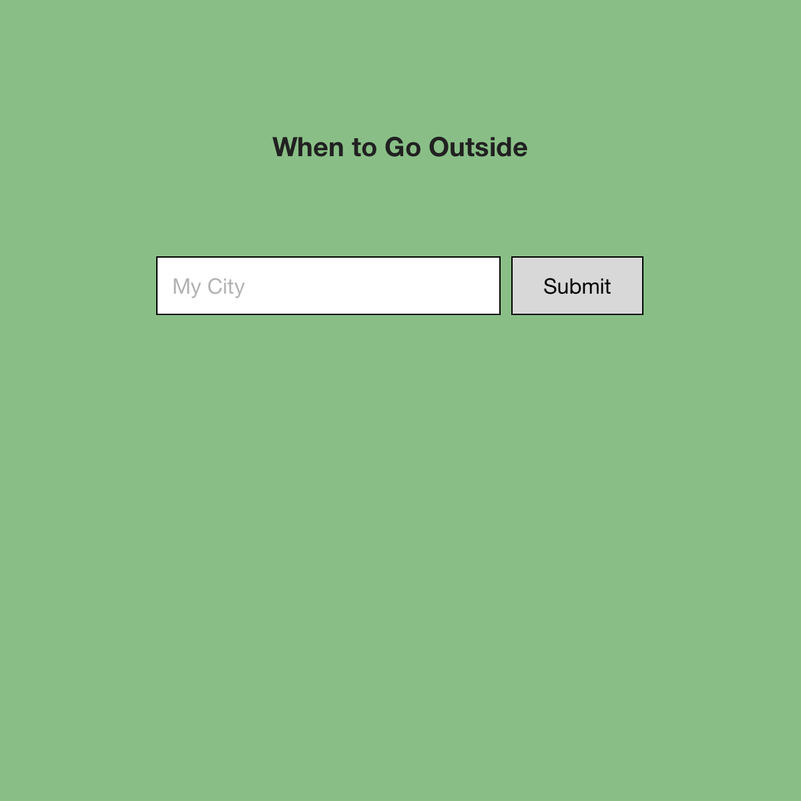
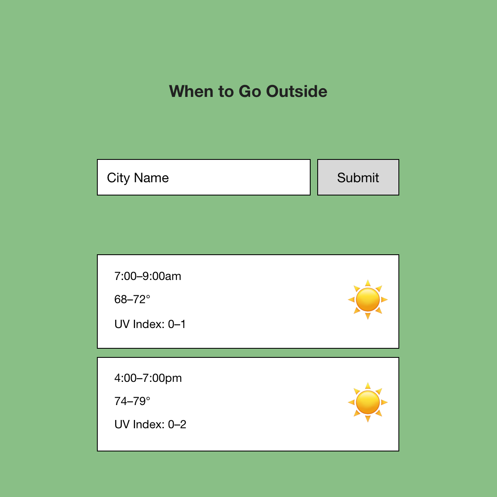

# When To Go Outside

[View deployed site](https://futureclint.github.io/when-to-go-outside/)

When To Go Outside was born out of manually parsing data from weather apps such as [Weather Line](https://weatherlineapp.com) or [Carrot Weather](http://www.meetcarrot.com/weather/) to figure out when the optimal time to go outside will be. Many factors come into play, such as UV Index: too high of a UV Index causes sunburn. Sunrise and sunset times change almost daily. Temperature, humidity, and precipitation chance all factor in as well. It would be nice to have an app do the work for you, and show you only the information you need to know to answer the question: When should I go outside today?

## OpenWeather API

After using the Geolocation API to gain the user's location (latitude and longitude), that data is passed into the [OpenWeather One Call API](https://openweathermap.org/api/one-call-api). This API provides sunrise and sunset times, as well as hourly weather data for a specific location. Here is a sample of hourly weather data:

```
{
    "dt": 1633654800,
    "temp": 292.1,
    "feels_like": 292.14,
    "pressure": 1022,
    "humidity": 80,
    "dew_point": 288.58,
    "uvi": 0,
    "clouds": 5,
    "visibility": 10000,
    "wind_speed": 3.73,
    "wind_deg": 186,
    "wind_gust": 4.7,
    "weather": [
        {
            "id": 800,
            "main": "Clear",
            "description": "clear sky",
            "icon": "01n"
        }
    ],
    "pop": 0
}
```

The data used from this in the MVP version of the site: `dt` (time), `temp`, `humidity`, and `uvi` (UV Index). Two items from the weather array are also used to display an icon representing the weather condition for the hour: `description` and `icon`. The description is used for the icon image's `alt` and `title` text. In addition, `current.sunrise` and `current.sunset` time data is used for the current day.

## Wireframes

The initial wireframes used in the brainstorming process contain a simple search field for location, which return horizontal cards which represent the ideal time spans to go outside today in that location.




## MVP

All of these features were completed for the initial launch of the project:

- Find user's location using the web Geolocation API.
- Pass user's location to a weather API and retrieve data.
- Parse the data and return hourly weather conditions.
- Render the conditions on the page.

## Post MVP

Of these future features, the first two were completed for the initial launch of the project.

- Parse the data to remove all hours pre-sunrise and post-sunset.
- Assign a quality index variable to each hour block.
- Parse the weather data to determine what the quality index is for each hour block.
- Display the quality index value as a bar on each hour block on the page along with the other information.
- Allow the user to search other locations for weather data.
- Show a loading graphic when the APIs are being called and the data is being parsed (this can take a few seconds).
- Display error messages when things go wrong.

## Timeframes

| Component | Priority | Estimated Time | Actual Time |
| --------- | :------: |  :-----------: | :---------: |
|Initial repo/page setup    | H | 1 hour   | 2 hours  |
|Geolocation API setup      | H | 1 hour   | 2 hours  |
|OpenWeather API setup      | H | 3 hours  | 4 hours  |
|Parsing data               | H | 12 hours | 18 hours |
|Front-end layout           | M | 6 hours  | 12 hours |
|Mobile layout              | M | 1 hour   | 2 hours  |
|Deployment                 | H | 2 hours  | 1 hour   |
|Documentation              | M | 1 hour   | 2 hours  |

Everything besides deployment took longer than expected. Sometimes much longer. Parsing the data took a surprising amount of time, to be honest.

## Code Snippet

I found the parsing-the-data part to be the most challenging and fulfilling. Here I assign hour blocks to an empty array, then figure out and delete the irrelevant hours, leaving only the hours left in the current data up to and including sunset hour:

```
for (let i = 0; i < 24; i++) {
    hourBlock[i] = weather.hourly[i];
}

let hoursLeft = 24 - Number((new Date(hourBlock[0].dt * 1000)).getHours());
let hoursPassed = 24 - hoursLeft;

for (hoursPassed; hoursPassed > 0; hoursPassed--) {
    hourBlock.pop();
}

for (let i = 0; i < hourBlock.length; i++) {
    let hour = getBlockHour(hourBlock[i]);
    if (hour < sunriseHour) {
        hourBlock.shift();
    }
}

for (let i = (hourBlock.length - 1); i > 0; i--) {
    let hour = getBlockHour(hourBlock[i]);
    if (hour > sunsetHour) {
        hourBlock.pop();
    }
}
```
